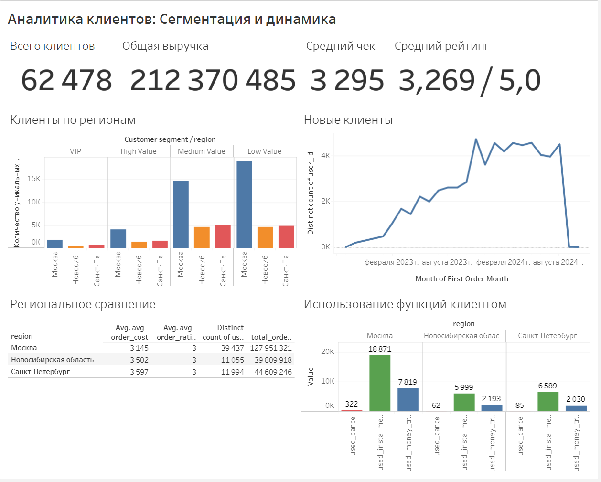

# Customer Analytics Dashboard — Tableau Public

> Интерактивный дашборд для анализа клиентской базы интернет-магазина с сегментацией, временной динамикой и региональным сравнением.

## Просмотр дашборда

**[Открыть интерактивный дашборд в Tableau Public](https://public.tableau.com/authoring/sql_vitrina_dash_tableau/CustomerAnalytics)**

## Превью

---

## Описание проекта

Дашборд создан для анализа **62,478 клиентов** интернет-магазина за период **2022-2024 гг.**

### Цели проекта
- Сегментация клиентов по уровню выручки (VIP, High Value, Medium, Low)
- Анализ динамики привлечения новых клиентов
- Сравнение поведения клиентов по регионам
- Оценка популярности функций платформы (рассрочка, переводы, отмены)

---

## Ключевые метрики (KPI)

| Метрика | Значение |
|---------|----------|
| Всего клиентов | 62,478 |
| Общая выручка | 212,370,485 ₽ |
| Средний чек | 3,295 ₽ |
| Средний рейтинг | 3.27 / 5.0 |

---

## Структура дашборда

### Сегментация клиентов по выручке и регионам
- Визуализация: Stacked Bar Chart
- Показывает распределение клиентов по 4 сегментам
- Разбивка по регионам: Москва, Санкт-Петербург, Новосибирская область

### Временная динамика привлечения клиентов
- Визуализация: Line Chart
- Период: октябрь 2022 — октябрь 2024
- Показывает тренд первых заказов по месяцам

### Региональное сравнение
- Визуализация: Text Table
- Метрики по каждому региону:
  - Количество клиентов
  - Общая выручка
  - Средний чек
  - Средний рейтинг заказов

### Использование функций платформы
- Визуализация: Grouped Bar Chart
- Сравнение использования рассрочки, переводов и отмен по регионам

---

## Ключевые инсайты

### Сегментация
- **45%** клиентов — Low Value (выручка < 2,000 ₽)
- **39%** клиентов — Medium Value (2,000–5,000 ₽)
- **13%** клиентов — High Value (5,000–10,000 ₽)
- **3%** клиентов — VIP (> 10,000 ₽)

### География
- **Москва** лидирует: 63% клиентов, 127 млн ₽ выручки
- **Санкт-Петербург**: 19% клиентов, 44 млн ₽
- **Новосибирская область**: 18% клиентов, 39 млн ₽

### Динамика роста
- **2022**: старт с ~100 клиентов/месяц
- **2023**: рост до пика ~4,500 клиентов/месяц
- **2024**: снижение активности (возможно неполные данные)

### Популярные функции
- **Рассрочка** — самая востребованная (19K пользователей в Москве)
- **Денежные переводы** — используют ~6-7K клиентов в каждом регионе
- **Отмены заказов** — минимальны (< 2K по всем регионам)

---

## Технологии

- **Tableau Public** — визуализация данных
- **Python/SQL** — подготовка данных (витрина)

---

## Данные

Визуализация подготовлена с помощью SQL-витрины из проекта [sql_vitrina](https://github.com/letme2112/sql_vitrina/).

**Что использовалось в визуализации:**
- `user_id` — уникальный ID клиента
- `region` — регион клиента
- `first_order_ts`, `last_order_ts` — даты первого и последнего заказа
- `total_order_costs` — общая выручка от клиента
- `avg_order_cost` — средний чек
- `avg_order_rating` — средний рейтинг заказов
- `total_orders` — количество заказов
- `used_installments`, `used_money_transfer`, `used_cancel` — флаги использования функций

---

